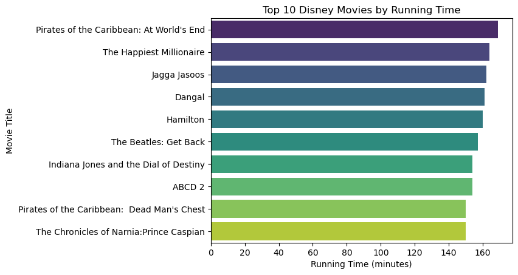
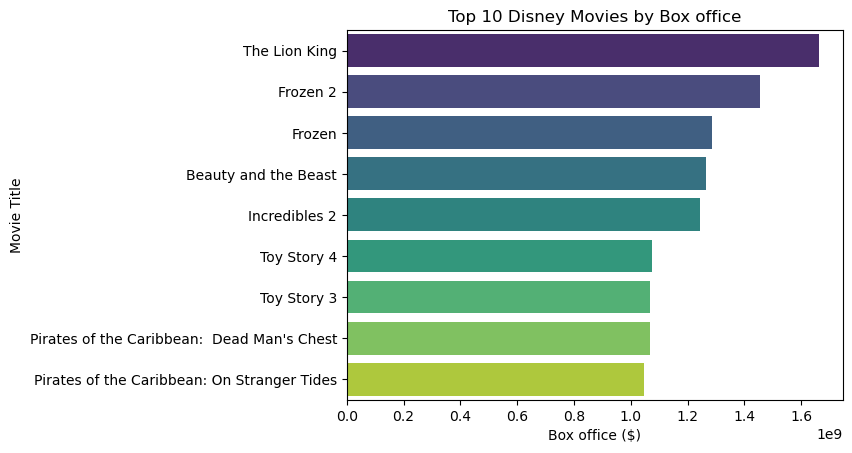

# Disney Movies Dataset (2023) Creation
This project involves the following tasks:
- Scraping the data of all the **Disney movies** from wiki using `Requests` and `Beautiful Soup` modules
- Extensively cleaning the dataset and formatting it into desirable data types
- Use OMDB API to add additional data of IMDB rating, Metascore and Rotten Tomatoes rating into your dataset
- Saving the dataset into json, csv and pickle formats
- Use prepared dataset for a quick data analysis

# Usage
```
$ jupyter notebook
```
Open the `Scraping_Disney_movies.ipynb`. All the code and steps are explained in this notebook.

# Code Preview

## Defining the functions for:

### Creating BeutifulSoup object using `lxml` parser

```python
def create_soup(url):
    try:
        response = requests.get(url)
        response.raise_for_status()
        soup = BeautifulSoup(response.content, "lxml")
        return soup
    except Exception:
        print("No Response from url")
        return None
```

### Scraping url of all movie titles from [List of Walt Disney Pictures films](https://en.wikipedia.org/wiki/List_of_Walt_Disney_Pictures_films)

```python       
def get_movies_url(url):
    movies_url = {}
    soup = create_soup(url)
    if soup:
        # Excluding last 2 tables of 'Undated films' and 'In development'
        tables = soup.select("table.wikitable")[:-2]
        # Selecting only the <i> tags which have <anchor> tag available
        for table in tables:
            movie_anchors = table.select("tbody tr td:first-child i a")
            for movie_anchor in movie_anchors:
                try:
                    title = movie_anchor.get_text(strip=True)
                    href = movie_anchor["href"]
                    absolute_url = "https://en.wikipedia.org" + href
                    movies_url[title] = absolute_url
                except Exception as e:
                    print(f"Error parsing the movie_anchor:\n{movie_anchor}\n{e}")

    return movies_url
```

### Scraping the info of movie page

```python
def get_movie_info(movie_url):
    movie_info = {}
    soup = create_soup(movie_url)
    if soup:
        table = soup.select("table.infobox.vevent")[0]
        table_rows = table.select("tr")

        for index, row in enumerate(table_rows):
            try:
                # Get title from first row of infobox table
                if index == 0:
                    title = row.th.get_text()
                    movie_info["title"] = title
                elif index == 1:
                    # Skip the picture
                    continue
                else:
                    # Some rows have only <th> while some have only <td> for example in 'Zoro' movie
                    # Skip these rows
                    if row.th and row.td:
                        label = row.th.get_text(" ", strip=True)
                        value = get_content_value(row.td)
                        movie_info[label] = value
                    else:
                        continue
            # Catch the exception in parsing row with comments showing the source of exception          
            except Exception as e:
                print(f"Could not parse value from row for movie: {title}")
                print(f"Error in row of infobox table: {index + 1}")
                print(e)
                return None
            
    return movie_info


def get_content_value(row_data):
    # Removing the <sup> (superscript) tag, <span> tag (which has hidden date) and <b> tag (used as heading in starring) 
    for tag in row_data.select("sup, span, b"):
        tag.decompose() 
        
    # Extracting the relevant cleaned text
    # If there are <li> or <br> tags then it (mostly) indicates list of texts otherwise it is single text
    # Strip the trailing spaces, and join bits of text by space in-between. Also replace escape characters.
    
    if row_data.select("li"):
        value = [li.get_text(" ", strip=True).replace("\xa0", " ") for li in row_data.select("li")]
    elif row_data.select("br"):
        value = [text for text in row_data.stripped_strings]
    else:
        value = row_data.get_text(" ", strip=True).replace("\xa0", " ")
    return value
```

## Scarping data of all 514 Disney movies:

```python
movies_data = {}
movies_url = get_movies_url("https://en.wikipedia.org/wiki/List_of_Walt_Disney_Pictures_films")
if movies_url:
    for index, (movie, url) in enumerate(movies_url.items()):
        if index%10 == 0:
            print(f"Scraping {index+1}th movie")
        movie_info = get_movie_info(url)
        if movie_info:
            movies_data[movie] = movie_info
        else:
            continue
```

### Printing the first value of `movies_data` dict:

    {'title': 'Snow White and the Seven Dwarfs', 
    'Directed by': ['David Hand', 'Perce Pearce', 'William Cottrell', 'Larry Morey', 'Wilfred Jackson', 'Ben Sharpsteen'], 
    'Story by': ['Ted Sears', 'Richard Creedon', 'Otto Englander', 'Dick Rickard', 'Earl Hurd', 'Merrill De Maris', 'Dorothy Ann Blank', 'Webb Smith'], 
    'Based on': ['Snow White', 'by the', 'Brothers Grimm'], 
    'Produced by': 'Walt Disney', 'Starring': ['Adriana Caselotti', 'Roy Atwell', 'Pinto Colvig', 'Otis Harlan', 'Scotty Mattraw', 'Billy Gilbert', 'Eddie Collins'], 
    'Music by': ['Frank Churchill', 'Leigh Harline', 'Paul Smith'], 
    'Production company': 'Walt Disney Productions', 
    'Distributed by': 'RKO Radio Pictures', 'Release dates': ['December 21, 1937 ( Carthay Circle Theatre )', 
    'February 4, 1938 (United States)'], 
    'Running time': '83 minutes', 
    'Country': 'United States', 
    'Language': 'English', 
    'Budget': '$1.5 million', 
    'Box office': '$418 million'}


## Saving and loading data (JSON)

```python
import json
with open("disney_data.json", "w", encoding="utf-8") as f:
    json.dump(movies_data, f, ensure_ascii=False, indent=2)
```


```python
import json
with open("disney_data.json", "r", encoding="utf-8") as f:
    movies_data = json.load(f)
```

## Data Cleaning and Transformation

### Coverting 'Running time' to integer

```python
import re
def minute_to_integer(running_time):
    if not running_time:
        return None
    elif isinstance(running_time, list):
        running_time = running_time[0]
    return int(re.findall(r"\d+", running_time)[0])
```


```python
# Adding 'Running time (minutes)' field
for movie in movies_data.values():
    running_time = movie.get("Running time")
    movie["Running time (minutes)"] = minute_to_integer(running_time)
```

### Converting Budget and Box office to floats

```python
def money_conversion(money):
    if not money:
        return None
    if isinstance(money, list):
        money = "".join(money)

    pattern = r"""
        (\$|₽)                          # Currency symbol: dollar sign or ₽ (ruble).
        \s?                             # Optional whitespace.
        (\d+(?:\.\d+)?)                 # Digits (integer or decimal part).
        \s?                             # Optional whitespace.
        (?:
            (?:
                (?:–|-|—)               # Dash symbol: – or - or —.
                \$?                     # Optional dollar sign.
                (?:\d+(?:\.\d+)?)       # Digits (integer or decimal part).
            )
            |
            (?:to[^A-Za-z]+)            # "to" followed by non-alphabet characters.
        )?
        \s*                             # Optional whitespace.
        (million|billion)?              # million or billion.
    """

    match = re.search(pattern, money.replace(",", ""), re.VERBOSE | re.IGNORECASE)
    if not match:
        return None
    currency_symbol = match.group(1)
    value = match.group(2)
    ammount = match.group(3)

    # Formating cuurency symbol (in dollars)
    if currency_symbol == "$":
        symbol = 1
    elif currency_symbol == "₽":
        symbol = 0.010661202

    # Formatting value
    value = float(value)

    # Formatting ammount (in dollars)
    if not ammount:
        ammount = 1
    elif ammount.lower() == "million":
        ammount = 1000000
    elif ammount.lower() == "billion":
        ammount = 1000000000
    
    formatted_money = symbol * value * ammount
    return formatted_money
```

*Check out test_money_conversion.py for unit testing*


```python
# Adding 'Box office (float)' and 'Budget (float)' fields
for movie in movies_data.values():
    Box_office = movie.get("Box office")
    Budget = movie.get("Budget")
    movie["Box office ($)"] = money_conversion(Box_office)
    movie["Budget ($)"] = money_conversion(Budget)
```

### Converting time to datetime object


```python
import re
from datetime import datetime
def convert_date(date):
    if not date:
        return None
    if isinstance(date, list):
        date = date[0]
    pattern = r"([A-Za-z]+)\s(\d{1,2},)\s(\d{4})" # matches 'November 14, 1962'
    match = re.search(pattern, date)
    date_format = "%B %d, %Y"
    if not match:
        pattern = r"(\d{1,2})\s([A-Za-z]+)\s(\d{4})" # matches '11 December 1963'
        match = re.search(pattern, date)
        date_format = "%d %B %Y"
        if not match:
            pattern = r"([A-Za-z]+)\s(\d{4})" # matches 'December 1963'
            match = re.search(pattern, date)
            date_format = "%B %Y"
            if not match:
                pattern = r"(\d{4})" # matches '2009'
                match = re.search(pattern, date)
                date_format = "%Y"
                
    return datetime.strptime(match.group(), date_format)
```

```python
# Adding the 'Realease date (datetime)' field
for movie in movies_data.values():
    date = movie.get('Release dates')
    if not date:
        date = movie.get("Release date")
        
    movie["Release date (datetime)"] = convert_date(date)
```

### Creating dataframe and further cleaning it


```python
import pandas as pd
import numpy as np
```

```python
df = pd.DataFrame(movies_data)
df = df.T

# Converting None to NaN for consistency
df = df.fillna(np.nan)

# Merging production company into production companies and Dropping unnecessary columns
df['Production companies'] = df['Production companies'].fillna(df["Production company"])
columns_to_drop = list(df.columns)[26:]
columns_to_drop.extend(["Narrated by", "Release date", "Release dates", "Running time", "Budget", "Box office", "Based on", "Production company", "Written by", "Story by"])
df.drop(columns = columns_to_drop, inplace=True)
```

#### Cleaning the list values

```python
def clean_list_value(list_value):
    if isinstance(list_value, list):
        cleaned_list_value = []
        for item in list_value:
            if item == "," or item =="" or (item.startswith("(") and item.endswith(")")):
                continue
            else:
                cleaned_list_value.append(item)
        return cleaned_list_value
    else:
        return list_value

cleaned_df = df.applymap(clean_list_value)
```

#### Keeping Consistency of type in columns


```python
def convert_to_list(value):
    if isinstance(value, str):
        return [x.strip() for x in value.split(",")]
    else:
        return value
    
def convert_to_str(value):
    if isinstance(value, list):
        return ", ".join(value)
    return value
```


```python
list_columns = ['Directed by',
               'Produced by',
               'Starring',
               'Music by',
               'Distributed by',
               'Screenplay by',
               'Cinematography',
               'Edited by',
               'Production companies']

str_columns = ["Country", "Language"]

cleaned_df[list_columns] = cleaned_df[list_columns].applymap(convert_to_list)
cleaned_df[str_columns] = cleaned_df[str_columns].applymap(convert_to_str)
cleaned_df.at["Fantasia", "Music by"] = np.nan
```

## Cleaned dataframe

```python
cleaned_df.head()
```

<div>
<table border="1">
  <thead>
    <tr style="text-align: right;">
      <th></th>
      <th>title</th>
      <th>Directed by</th>
      <th>Produced by</th>
      <th>Starring</th>
      <th>Music by</th>
      <th>Distributed by</th>
      <th>Country</th>
      <th>Language</th>
      <th>Running time (minutes)</th>
      <th>Box office ($)</th>
      <th>Budget ($)</th>
      <th>Release date (datetime)</th>
      <th>Screenplay by</th>
      <th>Cinematography</th>
      <th>Edited by</th>
      <th>Production companies</th>
    </tr>
  </thead>
  <tbody>
    <tr>
      <th>Snow White and the Seven Dwarfs</th>
      <td>Snow White and the Seven Dwarfs</td>
      <td>[David Hand, Perce Pearce, William Cottrell, L...</td>
      <td>[Walt Disney]</td>
      <td>[Adriana Caselotti, Roy Atwell, Pinto Colvig, ...</td>
      <td>[Frank Churchill, Leigh Harline, Paul Smith]</td>
      <td>[RKO Radio Pictures]</td>
      <td>United States</td>
      <td>English</td>
      <td>83.0</td>
      <td>418000000.0</td>
      <td>1500000.0</td>
      <td>1937-12-21</td>
      <td>NaN</td>
      <td>NaN</td>
      <td>NaN</td>
      <td>[Walt Disney Productions]</td>
    </tr>
    <tr>
      <th>Pinocchio</th>
      <td>Pinocchio</td>
      <td>[Robert Zemeckis]</td>
      <td>[Andrew Milano, Chris Weitz, Robert Zemeckis, ...</td>
      <td>[Tom Hanks, Benjamin Evan Ainsworth, Joseph Go...</td>
      <td>[Alan Silvestri]</td>
      <td>[Disney+]</td>
      <td>United States</td>
      <td>English</td>
      <td>105.0</td>
      <td>NaN</td>
      <td>150000000.0</td>
      <td>2022-09-08</td>
      <td>[Robert Zemeckis, Chris Weitz]</td>
      <td>[Don Burgess]</td>
      <td>[Jesse Goldsmith, Mick Audsley]</td>
      <td>[Walt Disney Pictures, Depth of Field, ImageMo...</td>
    </tr>
    <tr>
      <th>Fantasia</th>
      <td>Fantasia</td>
      <td>[Samuel Armstrong, James Algar, Bill Roberts, ...</td>
      <td>[Walt Disney, Ben Sharpsteen]</td>
      <td>[Leopold Stokowski, Deems Taylor]</td>
      <td>NaN</td>
      <td>[RKO Radio Pictures]</td>
      <td>United States</td>
      <td>English</td>
      <td>126.0</td>
      <td>76400000.0</td>
      <td>2280000.0</td>
      <td>1940-11-13</td>
      <td>NaN</td>
      <td>[James Wong Howe]</td>
      <td>NaN</td>
      <td>[Walt Disney Productions]</td>
    </tr>
    <tr>
      <th>The Reluctant Dragon</th>
      <td>The Reluctant Dragon</td>
      <td>[Alfred Werker, Hamilton Luske, Jack Cutting, ...</td>
      <td>[Walt Disney]</td>
      <td>[Robert Benchley, Frances Gifford, Buddy Peppe...</td>
      <td>[Frank Churchill, Larry Morey]</td>
      <td>[RKO Radio Pictures]</td>
      <td>United States</td>
      <td>English</td>
      <td>74.0</td>
      <td>960000.0</td>
      <td>600000.0</td>
      <td>1941-06-27</td>
      <td>NaN</td>
      <td>[Bert Glennon]</td>
      <td>[Paul Weatherwax]</td>
      <td>[Walt Disney Productions]</td>
    </tr>
    <tr>
      <th>Dumbo</th>
      <td>Dumbo</td>
      <td>[Tim Burton]</td>
      <td>[Justin Springer, Ehren Kruger, Katterli Fraue...</td>
      <td>[Colin Farrell, Michael Keaton, Danny DeVito, ...</td>
      <td>[Danny Elfman]</td>
      <td>[Walt Disney Studios, Motion Pictures]</td>
      <td>United States</td>
      <td>English</td>
      <td>112.0</td>
      <td>353300000.0</td>
      <td>170000000.0</td>
      <td>2019-03-11</td>
      <td>[Ehren Kruger]</td>
      <td>[Ben Davis]</td>
      <td>[Chris Lebenzon]</td>
      <td>[Walt Disney Pictures, Tim Burton Productions,...</td>
    </tr>
  </tbody>
</table>
</div>


## Saving Cleaned Data as pickle 

*We cannot save as json because of the datetime object. So instead we will save as pickle*

```python
# Converting nan values to None and then converting to dict
cleaned_df_None = cleaned_df.replace({np.nan:None})
movies_data_dict = cleaned_df_None.to_dict(orient='index')
```

#### Saving data to pickle

```python
import pickle
with open("disney_data_cleaned.pickle", "wb") as f:
    pickle.dump(movies_data_dict, f)
```

#### Load data from pickle


```python
import pickle
with open("disney_data_cleaned.pickle", "rb") as f:
    movies_data_dict = pickle.load(f)
```

## Adding additional data using API


```python
import os
import urllib
import requests

def get_data_from_api(movie):
    parameters = {"apikey":os.environ["OMDB_API_KEY"], "t":movie}
    query_url = urllib.parse.urlencode(parameters)
    base_url = "http://www.omdbapi.com/"
    url = f"{base_url}?{query_url}"
    movie_data = requests.get(url).json()
    return movie_data
```

```python
# Add Genre, Plot, Awards, Poster, imdb, metascore and rotten_tomatoes 
for index, movie in enumerate(movies_data_dict.values()):
    print(f"Processing movie {index+1}")
    movie_data_api = get_data_from_api(movie.get("title"))

    Genre = movie_data_api.get("Genre")
    movie["Genre"] = Genre.split(", ") if Genre else None

    plot = movie_data_api.get("Plot")
    movie["Plot"] = plot if plot and plot != "N/A" else None
    
    movie["Awards"] = movie_data_api.get("Awards")
    
    poster = movie_data_api.get("Poster")
    movie["Poster"] = poster if poster and poster != "N/A" else None

    imdb = movie_data_api.get("imdbRating")
    movie["imdb"] = float(imdb) if imdb and imdb != "N/A" else None

    metascore = movie_data_api.get("Metascore")
    movie["metascore"] = float(metascore) if metascore and metascore != "N/A"  else None

    rotten_tomatoes_rating = None
    ratings = movie_data_api.get("Ratings")
    if ratings:
        for rating in ratings:
            if rating.get("Source") == "Rotten Tomatoes":
                score = rating.get("Value")
                rotten_tomatoes_rating = float(score.strip("%")) if score and score != "N/A" else None
        
    movie["rotten_tomatoes (%)"] = rotten_tomatoes_rating
```

```python
movies_data_dict["The Lion King"]
```


    {'title': 'The Lion King',
     'Directed by': ['Jon Favreau'],
     'Produced by': ['Jon Favreau', 'Jeffrey Silver', 'Karen Gilchrist'],
     'Starring': ['Donald Glover',
      'Seth Rogen',
      'Chiwetel Ejiofor',
      'Alfre Woodard',
      'Billy Eichner',
      'John Kani',
      'John Oliver',
      'Beyoncé Knowles-Carter',
      'James Earl Jones'],
     'Music by': ['Hans Zimmer'],
     'Distributed by': ['Walt Disney Studios', 'Motion Pictures'],
     'Country': 'United States',
     'Language': 'English',
     'Running time (minutes)': 118.0,
     'Box office ($)': 1663000000.0,
     'Budget ($)': 250000000.0,
     'Release date (datetime)': 'July 09, 2019',
     'Screenplay by': ['Jeff Nathanson'],
     'Cinematography': ['Caleb Deschanel'],
     'Edited by': ['Mark Livolsi', 'Adam Gerstel'],
     'Production companies': ['Walt Disney Pictures', 'Fairview Entertainment'],
     'Genre': ['Animation', 'Adventure', 'Drama'],
     'Plot': 'Lion prince Simba and his father are targeted by his bitter uncle, who wants to ascend the throne himself.',
     'Awards': 'Won 2 Oscars. 43 wins & 35 nominations total',
     'Poster': 'https://m.media-amazon.com/images/M/MV5BYTYxNGMyZTYtMjE3MS00MzNjLWFjNmYtMDk3N2FmM2JiM2M1XkEyXkFqcGdeQXVyNjY5NDU4NzI@._V1_SX300.jpg',
     'imdb': 8.5,
     'metascore': 88.0,
     'rotten_tomatoes (%)': 93.0}


**Saving as pickle**


```python
import pickle
with open("disney_data_cleaned_added.pickle", "wb") as f:
    pickle.dump(movies_data_dict, f)
```

**Loading pickle**


```python
import pickle
with open("disney_data_cleaned_added.pickle", "rb") as f:
    movies_data_dict = pickle.load(f)
```


## Saving as csv and json

### Saving as csv

```python
import pandas as pd
import numpy as np
```


```python
movies_data_df = pd.DataFrame(movies_data_dict)
```


```python
movies_data_df = movies_data_df.T.reset_index(drop=True).replace({None:np.nan})
```

**Saving**


```python
movies_data_df.to_csv("disney_data_cleaned_added.csv", index=False)
```

*CSV files are text-based and do not inherently support complex data structures like lists. To solve this problem and preserve the list structure when saving and loading DataFrames, you can use the pickle format or JSON format instead of CSV*

### Saving as json

**First convert the datatime object to string**


```python
movies_data_dict_json = movies_data_dict.copy()
```


```python
for movie in movies_data_dict_json.values():
    date = movie.get('Release date (datetime)')
    if date:
        date = date.strftime("%B %d, %Y")
    movie['Release date (datetime)'] = date
```

**Saving**


```python
import json
with open("disney_data_cleaned_added.json", "w", encoding="utf-8") as f:
    json.dump(movies_data_dict_json, f, ensure_ascii=False, indent=2)
```


```python
with open("disney_data_cleaned_added.json", "r", encoding="utf-8") as f:
    movie_data_dict_cleaned_added = json.load(f)
```

## Final Prepared dataset:

**Each dataset entry is in the following foramt:**

```python
movie_data_dict_cleaned_added["Toy Story 3"]
```


    {'title': 'Toy Story 3',
     'Directed by': ['Lee Unkrich'],
     'Produced by': ['Darla K. Anderson'],
     'Starring': ['Tom Hanks',
      'Tim Allen',
      'Joan Cusack',
      'Don Rickles',
      'Wallace Shawn',
      'John Ratzenberger',
      'Estelle Harris',
      'Ned Beatty',
      'Michael Keaton',
      'Jodi Benson',
      'John Morris'],
     'Music by': ['Randy Newman'],
     'Distributed by': ['Walt Disney Studios', 'Motion Pictures'],
     'Country': 'United States',
     'Language': 'English',
     'Running time (minutes)': 103.0,
     'Box office ($)': 1067000000.0,
     'Budget ($)': 200000000.0,
     'Release date (datetime)': 'June 12, 2010',
     'Screenplay by': ['Michael Arndt'],
     'Cinematography': ['Jeremy Lasky', 'Kim White'],
     'Edited by': ['Ken Schretzmann'],
     'Production companies': ['Walt Disney Pictures', 'Pixar Animation Studios'],
     'Genre': ['Animation', 'Adventure', 'Comedy'],
     'Plot': "The toys are mistakenly delivered to a day-care center instead of the attic right before Andy leaves for college, and it's up to Woody to convince the other toys that they weren't abandoned and to return home.",
     'Awards': 'Won 2 Oscars. 62 wins & 96 nominations total',
     'Poster': 'https://m.media-amazon.com/images/M/MV5BMTgxOTY4Mjc0MF5BMl5BanBnXkFtZTcwNTA4MDQyMw@@._V1_SX300.jpg',
     'imdb': 8.3,
     'metascore': 92.0,
     'rotten_tomatoes (%)': 98.0}


## Quick Analysis

```python
import pandas as pd
import seaborn as sns
import matplotlib.pyplot as plt

df = pd.read_json("disney_data_cleaned_added.json")
df = df.T.replace({None:np.nan})
```

```python
top_10_longest_movies = df.sort_values(by="Running time (minutes)", ascending=False).head(10)
top_10_highest_Box_office = df.sort_values(by="Box office ($)", ascending=False).head(10)
```

### Top 10 longest running disney movies


```python
sns.barplot(data=top_10_longest_movies, x="Running time (minutes)", y="title", palette="viridis")
plt.title('Top 10 Disney Movies by Running Time')
plt.xlabel('Running Time (minutes)')
plt.ylabel('Movie Title');
```


    

    


### Top 10 movies with highest Box office


```python
sns.barplot(data=top_10_highest_Box_office, x="Box office ($)", y="title", palette="viridis")
plt.title('Top 10 Disney Movies by Box office')
plt.xlabel('Box office ($)')
plt.ylabel('Movie Title');
```


    

    


### Movies in which "Chris Buck" was director


```python
df[df["Directed by"].apply(lambda x: "Chris Buck" in x if isinstance(x, list) else False)]
```


<div>
<table border="1" class="dataframe">
  <thead>
    <tr style="text-align: right;">
      <th></th>
      <th>title</th>
      <th>Directed by</th>
      <th>Produced by</th>
      <th>Starring</th>
      <th>Music by</th>
      <th>Distributed by</th>
      <th>Country</th>
      <th>Language</th>
      <th>Running time (minutes)</th>
      <th>Box office ($)</th>
      <th>...</th>
      <th>Cinematography</th>
      <th>Edited by</th>
      <th>Production companies</th>
      <th>Genre</th>
      <th>Plot</th>
      <th>Awards</th>
      <th>Poster</th>
      <th>imdb</th>
      <th>metascore</th>
      <th>rotten_tomatoes (%)</th>
    </tr>
  </thead>
  <tbody>
    <tr>
      <th>Tarzan</th>
      <td>Tarzan</td>
      <td>[Kevin Lima, Chris Buck]</td>
      <td>[Bonnie Arnold]</td>
      <td>[Tony Goldwyn, Minnie Driver, Glenn Close, Ale...</td>
      <td>[Mark Mancina]</td>
      <td>[Buena Vista Pictures Distribution]</td>
      <td>United States</td>
      <td>English</td>
      <td>88.0</td>
      <td>4.482000e+08</td>
      <td>...</td>
      <td>NaN</td>
      <td>[Gregory Perler]</td>
      <td>[Walt Disney Pictures, Walt Disney Feature Ani...</td>
      <td>[Animation, Adventure, Comedy]</td>
      <td>A man raised by gorillas must decide where he ...</td>
      <td>Won 1 Oscar. 11 wins &amp; 23 nominations total</td>
      <td>https://m.media-amazon.com/images/M/MV5BY2ZiYWUxN2ItYmQxZi00NDlkLWE2NDAtOTNmYTg1MDI0NDk1XkEyXkFqcGdeQXVyNjUwNzk3NDc@._V1_SX300.jpg</td>
      <td>7.3</td>
      <td>79.0</td>
      <td>89.0</td>
    </tr>
    <tr>
      <th>Frozen</th>
      <td>Frozen</td>
      <td>[Chris Buck, Jennifer Lee]</td>
      <td>[Peter Del Vecho]</td>
      <td>[Kristen Bell, Idina Menzel, Jonathan Groff, J...</td>
      <td>[Christophe Beck (score), Robert Lopez (songs)...</td>
      <td>[Walt Disney Studios, Motion Pictures]</td>
      <td>United States</td>
      <td>English</td>
      <td>102.0</td>
      <td>1.285000e+09</td>
      <td>...</td>
      <td>[Mohit Kallianpur]</td>
      <td>[Jeff Draheim]</td>
      <td>[Walt Disney Pictures, Walt Disney Animation S...</td>
      <td>[Animation, Adventure, Comedy]</td>
      <td>When the newly crowned Queen Elsa accidentally...</td>
      <td>Won 2 Oscars. 83 wins &amp; 60 nominations total</td>
      <td>https://m.media-amazon.com/images/M/MV5BMTQ1MjQwMTE5OF5BMl5BanBnXkFtZTgwNjk3MTcyMDE@._V1_SX300.jpg</td>
      <td>7.4</td>
      <td>75.0</td>
      <td>90.0</td>
    </tr>
    <tr>
      <th>Frozen II</th>
      <td>Frozen 2</td>
      <td>[Chris Buck, Jennifer Lee]</td>
      <td>[Peter Del Vecho]</td>
      <td>[Kristen Bell, Idina Menzel, Josh Gad, Jonatha...</td>
      <td>[Christophe Beck (score), Robert Lopez (songs)...</td>
      <td>[Walt Disney Studios, Motion Pictures]</td>
      <td>United States</td>
      <td>English</td>
      <td>103.0</td>
      <td>1.453000e+09</td>
      <td>...</td>
      <td>[Mohit Kallianpur]</td>
      <td>[Jeff Draheim]</td>
      <td>[Walt Disney Pictures, Walt Disney Animation S...</td>
      <td>[Documentary, Family]</td>
      <td>With less than a year until the world premiere...</td>
      <td>N/A</td>
      <td>https://m.media-amazon.com/images/M/MV5BYmQ5ZWE0ZWUtNzY0Zi00MmZhLWIzNTgtNDk1MTBiMDNmMmZjXkEyXkFqcGdeQXVyMTkxNjUyNQ@@._V1_SX300.jpg</td>
      <td>8.5</td>
      <td>NaN</td>
      <td>NaN</td>
    </tr>
    <tr>
      <th>Wish</th>
      <td>Wish</td>
      <td>[Chris Buck, Fawn Veerasunthorn]</td>
      <td>[Peter Del Vecho, Juan Pablo Reyes]</td>
      <td>[Ariana DeBose, Chris Pine, Alan Tudyk]</td>
      <td>[David Metzger]</td>
      <td>[Walt Disney Studios, Motion Pictures]</td>
      <td>United States</td>
      <td>English</td>
      <td>NaN</td>
      <td>NaN</td>
      <td>...</td>
      <td>NaN</td>
      <td>NaN</td>
      <td>[Walt Disney Pictures, Walt Disney Animation S...</td>
      <td>[Animation, Adventure, Comedy]</td>
      <td>When Puss in Boots discovers that his passion ...</td>
      <td>Nominated for 1 Oscar. 5 wins &amp; 51 nominations...</td>
      <td>https://m.media-amazon.com/images/M/MV5BNjMyMDBjMGUtNDUzZi00N2MwLTg1MjItZTk2MDE1OTZmNTYxXkEyXkFqcGdeQXVyMTQ5NjA0NDM0._V1_SX300.jpg</td>
      <td>7.9</td>
      <td>73.0</td>
      <td>NaN</td>
    </tr>
  </tbody>
</table>
<p>4 rows × 23 columns</p>
</div>


